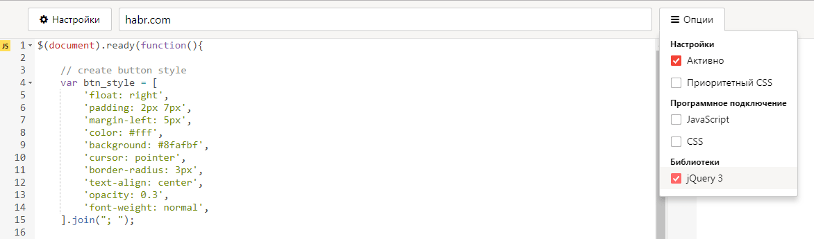
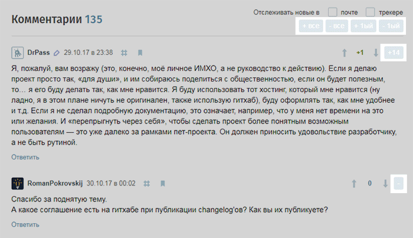

# JS скрипт для скрытия веток комментариев на Habr.com

Чтобы использовать данный скрипт в вашем браузере, нужно установить любой плагин, позволяющий:
  - запускать JS скрипты на выбранной вами странице или домене;
  - подключать jQuery при загрузке старницы.

Например, вы можете выбрать плагин ["User JavaScript and CSS"](https://chrome.google.com/webstore/detail/user-javascript-and-css/nbhcbdghjpllgmfilhnhkllmkecfmpld) для  Chrome или любой другой, похожий на него.

Затем вам нужно создать правило для домена Habr.com, вставить содержимое файла [script.js](script.js) в поле для JavaScript и убедиться, что плагин подключает jQuery к странице.

Вот и всё! После сохранения и активации нового правила, и перезагрузки странички на Habr.com, вы увидите кнопки сворачивания ветки в заголовке каждого комментария.

### Пример настроек для "User JavaScript and CSS"

### Вид кнопок на сайте

# JS script for toggling Habr.com comment threads

To use this script in your browser you should install any plugin that allows you: 
  - to run JS scripts in selected pages or any pages in a domen.
  - to inject jQuery in your pages

For example you can choose ["User JavaScript and CSS"](https://chrome.google.com/webstore/detail/user-javascript-and-css/nbhcbdghjpllgmfilhnhkllmkecfmpld) plugin for Chrome or any other.

Then you should create a new rule for the Habr.com domen, insert the content of [script.js](script.js) file into the JavaScript section and make sure the plugin is injecting jQuery into the pages.

That's it! After saving and activating a new rule and reloading Habr.com page you'll see close/open buttons in the head of every comment.

### Settings example for "User JavaScript and CSS"

### Buttons at the site

